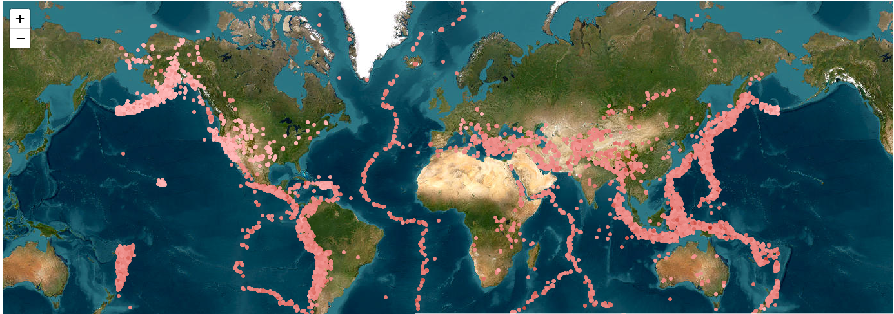

# Data Visualization

# Group 13:

## Project 2: The earth beneath us

## Guideline:

- clone this repo and read the module description
- read through the Map Tutorial [here](https://docs.google.com/document/d/1-pbd7xuD7Aprm2oecZHX-VAc263pCsSjMs3ONCVTf_Y/edit?tab=t.0)

### Team Member:

- Nhat Nguyen
- Long Nguyen
- Du Nguyen

### Project Structure

- `css` folder: stores all the styling files
- `data` folder: stores .csv files
- `images` folder: stores any images used in the page
- `js` folder: stores all the bts `js` code
- `documentation` folder: stores any documentation

### Coordinating plan

- We will meet 2 times a week for updates. We prefer to have in-person meeting during weekday after class or any necessary online meeting after class

- We will used branches for commiting our code to the online code base and will have a code review before merging any branches to main

### Sketches

This is the basic leaflet.

Level 2 approach:

We have some ideas to approach this problem

- We will have the changes in map data overtime, showing data point overtime
- We can have 2 map standing to each other to compare the changes between 2 periods
- We can also use color scale effects (fading and changing color + opacity to show the changes)

Level 3 + 4 approach:

We decide to have different color scale for different attributes. A selection will be used to toggle between the attributes

Brushing + Linking: will be used to zoomed in and scanned.

### Timeline

- 3.10 - 3.16: Pre-Project Preparation: Team members will spend their time to read the documentation, do their own researches and play with leaflet D3.
- 3.17 - 3.23: Brainstorming and Sketching in the first half, and try to implement our sketches
- 3.23 - 3.29: Finalizing our design and deploy our product

# Project 2 Documentation
With our application, the user will be able to see all the quakes that happened from 2004 to 2025 all around the world. By visualizing these patterns with multiple coordinated views, users can:
- Identify areas with high seismic activities.
- Understand the magnitude-depth relationships when it comes to earthquakes.
- Explore regional seismic characteristics with the region filter.

### Data
**Dataset**: We compiled the data ourselves to get the most information we possibly could for all the quakes from 2014-2025.
**Source**: https://earthquake.usgs.gov/earthquakes/search/

**Fields in our data**: 
- Time (UTC timestamp)
- Latitude and Longitude for location.
- Depth of the quakes.
- Magnitude and magnitude type.
- A specific ID for each quake.
- Specific location (country and Continent) for regional filtering.

### Visualization Components
#### 1. Interactive Leaflet Map
The map features color-coded earthquakes by magnitude (the redder the dot, the bigger the quake). A tooltip will reveal itself as the user hovers over a dot. The map supports multiple base options, allowing users to see how quakes affect the world in several views. We also allow for filtering between continents, which will give the user important insights on more local/regional seismic activities.

#### 2. Timeline Bubble Chart
The bubble chart shows the timeline and how many quakes there are in a given month in a year. The user can toggle between chronological or packed layouts, which will allow them to compare between months more easily.

#### 3. Bar Charts
These charts show the distributions of quakes by their magnitudes and depths, allowing users to see the most common types of quakes. It also interacts with the rest of the charts by having dynamic filters as well as axes that updates with the leaflet map as time goes on.

### Interactions
In our application, you can have a number of filters that will affect the visualizations on the page. Selecting a particular region will only show data from that region, interacting with the bubble chart will only show quakes that happened during that particular month, etc... There is also a slider which allows for the quakes to be animated based on the time of their occurrence.

## Key Findings
#### 1. The Pacific Ring of Fire
While testing our filters, I saw that a lot of high magnitude (>6.0) quakes happen along a prettry well-defined circle. After looking it up, I found something called the Pacific Ring of Fire, which is where the tectonic plates meet! Pretty cool stuff!

#### 2. Depth-Magnitude relationship?
After messing around with the filters a little bit, I saw that a lot of shallower quakes show a wider magnitude variation. Again, after some research, I saw that shallow quakes vary in magnitudes because their energy is directly affecting the surface, while the deeper quakes get their energy dispersed throughout, not affecting the surface as much.

## Technicality
All our code can be found right here in this repo (https://github.com/huuquangnhatnguyen/DataVisualizationProject2)

## Demo
[https://youtu.be/e6JrpEnoIrQ](https://youtu.be/e6JrpEnoIrQ)

We split the work up pretty evenly, with one person handling a small aspect of each level all the way up to level 6. More specifically, here's how we divided the work:

#### Nhat Nguyen
- Gathered and processed data
- Debugging, making sure the final application works.
- Made the Leaflet Map

#### Du Nguyen
- Gathered and processed data
- Main Developer on the Bubble Chart

#### Jack Nguyen
- Worked on Interactivity and Data Linking
- Made the Bar Charts and their respective filters.

